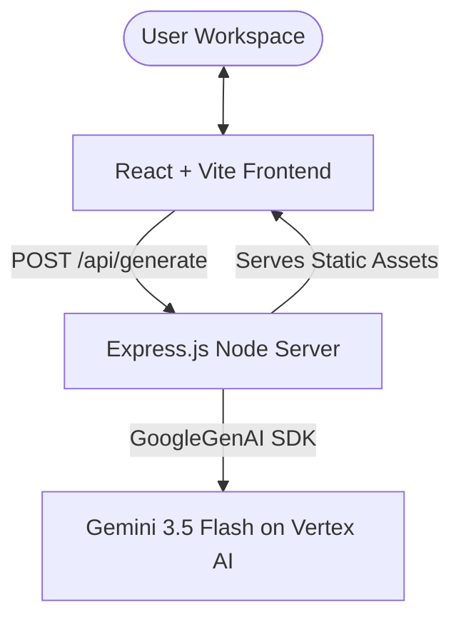

# Agent Architect 🚀 — System Design & Architecture Blueprint

This document acts as the persistent system design reference for the **Agent Architect** application. It details the system architecture, component model, data flow, backend prompts/constraints, and deployment setup to ensure rapid context loading in future sessions.

---

## 🏗️ System Overview & Architecture

Agent Architect is a premium, modern web application designed to generate high-ROI, low-code agent blueprints for **Gemini Enterprise** (Vertex AI Agent Engine). Users select connectors, tune capabilities, provide optional business context, and receive structured agent configurations.

The project is structured as a monorepo containing two main folders:
1. **Frontend (`/frontend`)**: A Vite + React Single-Page Application (SPA) styled with vanilla CSS, implementing premium dark/light glassmorphism designs.
2. **Backend (`/backend`)**: An Express.js application acting as an API server and static host, powered by the new `@google/genai` SDK on Vertex AI.



---

## 🎨 Design System & Aesthetics

The UI matches high-fidelity premium design standards:
- **Typography**: Uses the `Outfit` font for body copy and `Space Grotesk` for headings.
- **Styling**: Utilizes CSS variables in `index.css` for instant theme swapping (Light Mode / Dark Mode). Uses modern gradients, micro-animations, glassmorphism (`backdrop-filter`), and 3D card flips.
- **Grid Layout**: Responsive grid system displaying generated blueprints as interactive flip cards.

---

## 📁 Key Components & Code Map

### 1. Frontend Structure (`/frontend/src`)

- **[App.jsx](file:///usr/local/google/home/wdufrin/Documents/Code/low-code%20usecases/frontend/src/App.jsx)**: Main orchestration component. Manages states for selected connectors, user context, theme, and API load status.
- **[ConnectorSelector.jsx](file:///usr/local/google/home/wdufrin/Documents/Code/low-code%20usecases/frontend/src/components/ConnectorSelector.jsx)**: Lists native enterprise connectors with their sync capabilities and authentication types:
  - Third-party: `GitHub`, `Slack`, `Box`
  - Microsoft: `SharePoint`, `Jira`, `Confluence`
  - Google Workspace: `Google Drive`, `Gmail`, `Google Calendar`, `Google Chat`
  - GCP Data Lakes: `BigQuery`, `Cloud Storage`
- **[AgentCard.jsx](file:///usr/local/google/home/wdufrin/Documents/Code/low-code%20usecases/frontend/src/components/AgentCard.jsx)**: Renders each generated agent. Uses CSS transition 3D properties to flip when clicked, revealing the generated instructions, prompt trigger, and copy buttons.
- **[ConnectorModal.jsx](file:///usr/local/google/home/wdufrin/Documents/Code/low-code%20usecases/frontend/src/components/ConnectorModal.jsx)**: Configures specific sync capabilities or overrides for individual selected connectors.
- **[SettingsModal.jsx](file:///usr/local/google/home/wdufrin/Documents/Code/low-code%20usecases/frontend/src/components/SettingsModal.jsx)**: Handles global preferences, theme settings, and workspace exclusions.
- **[HelpModal.jsx](file:///usr/local/google/home/wdufrin/Documents/Code/low-code%20usecases/frontend/src/components/HelpModal.jsx)**: Embeds walkthroughs and demo guides (`.webp` videos) for on-boarding users.

### 2. Backend Server (`/backend`)

- **[server.js](file:///usr/local/google/home/wdufrin/Documents/Code/low-code%20usecases/backend/server.js)**: Runs on port `3002` locally (or uses `process.env.PORT` on Cloud Run).
  - Initializes Google GenAI client pointing to Vertex AI:
    ```javascript
    const ai = new GoogleGenAI({
      vertexai: true,
      project: process.env.GCP_PROJECT || 'ancient-sandbox-322523',
      location: process.env.GCP_LOCATION || 'us-central1',
    });
    ```
  - Exposes the `/api/generate` POST endpoint.

---

## 🤖 Prompt & Structured JSON Output Schema

The Express backend uses **Structured Outputs** via Gemini's `responseSchema` to ensure valid JSON payloads are returned.

### JSON Output Schema Definition:
```json
{
  "type": "array",
  "items": {
    "type": "object",
    "properties": {
      "name": { "type": "string" },
      "summary": { "type": "string" },
      "connectors": { "type": "array", "items": { "type": "string" } },
      "model": { "type": "string", "enum": ["Gemini 3 Flash", "Gemini 3.1 Pro", "Gemini 3.5 Flash"] },
      "instructions": { "type": "string" },
      "levelOfComplexity": { "type": "string", "enum": ["Easy", "Medium", "Hard"] },
      "schedule": {
        "type": "object",
        "properties": {
          "trigger": { "type": "string" },
          "prompt": { "type": "string" }
        }
      }
    },
    "required": ["name", "summary", "connectors", "instructions", "levelOfComplexity"]
  }
}
```

### Prompt Engineering Guidelines & System Constraints:
- **Connector Filtering**: Notion, Shopify, and other non-listed tools are treated as **unsupported** for direct grounding.
- **Scheduling Rules**: Exactly 1 or 2 agents returned must be **on-demand** (omitting the `schedule` property entirely). A backend fail-safe programmatically deletes `schedule` from the first two items if generated incorrectly.
- **Instructions Formatting**: Must be written as a single, cohesive starter prompt. **No numbered lists** are allowed.

---

## 🚀 Deployment & Build Pipeline

The project uses Google Cloud Build to automate compilation, containerization, and hosting on Google Cloud Run.

- **[cloudbuild.yaml](file:///usr/local/google/home/wdufrin/Documents/Code/low-code%20usecases/cloudbuild.yaml)**:
  1. Compiles React frontend static assets (`npm run build` inside `/frontend`).
  2. Syncs/copies `/frontend/dist` to `/backend/public/`.
  3. Builds Docker container using `/backend/Dockerfile`.
  4. Deploys container image to Cloud Run service `agent-architect` in `us-central1`.
